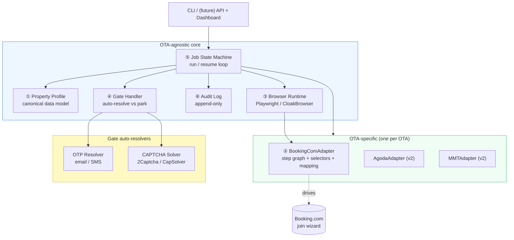
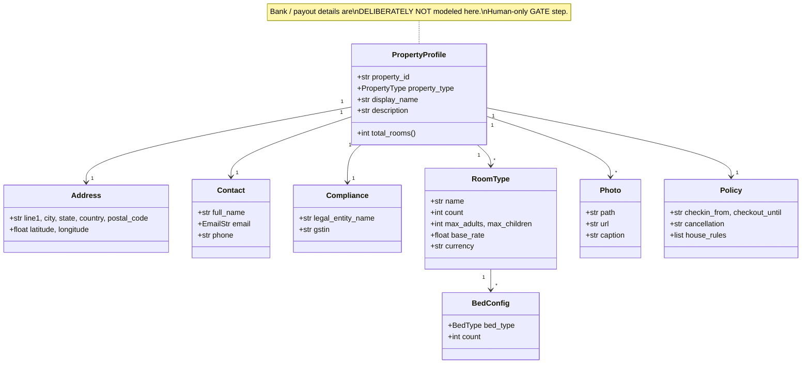
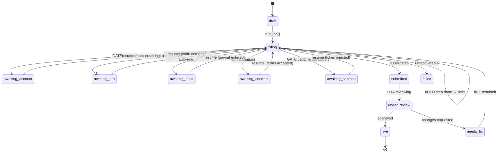
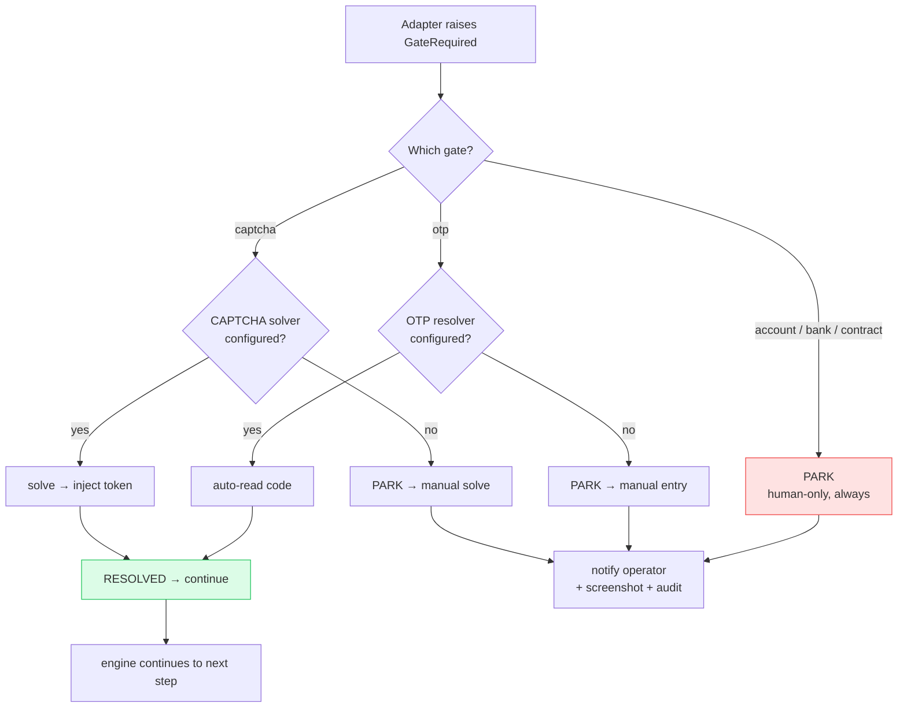
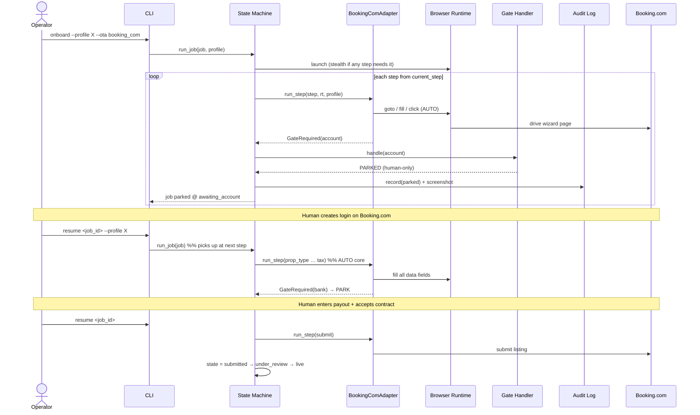
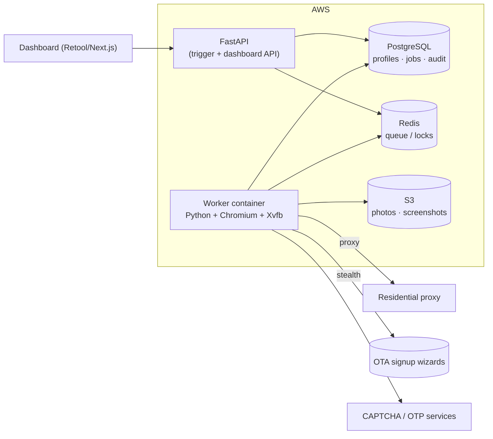
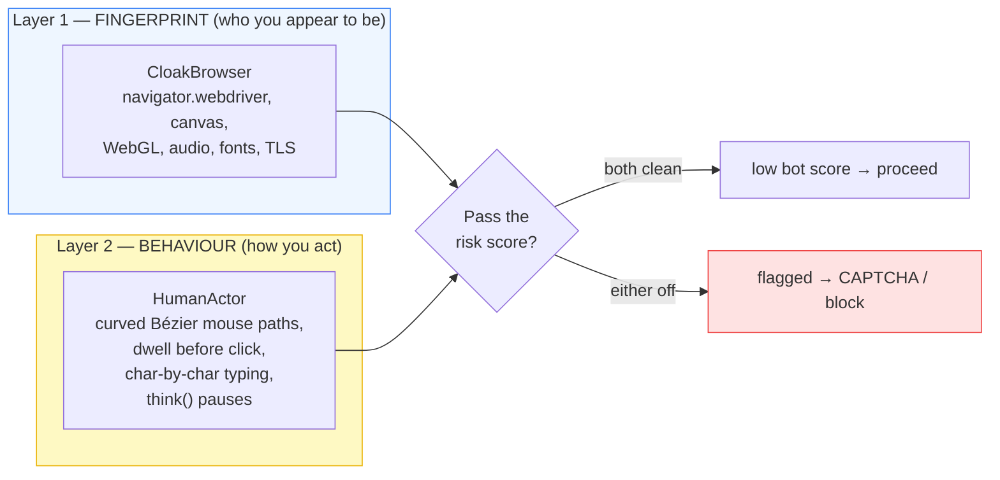

# Accounts Pilot — Architecture

> Automated OTA **property-onboarding**. Drives an OTA's "List your property" wizard
> from one canonical profile, auto-filling every data field and pausing at the steps
> that require a human (account, OTP, bank, contract).

---

## 1. What this is (and isn't)

| It IS | It is NOT |
|---|---|
| A robot that **lists your properties onto** OTAs | A channel manager |
| Driven by a single canonical **Property Profile** | A guest-data scraper |
| **Human-in-the-loop** at credential/financial/legal steps | A fully hands-off bot |
| **OTA-agnostic core**, one adapter per OTA | Booking.com-only by design |

The inventory / rate / booking-engine sync (the "channel manager" part) is a deliberate
**later** phase. v1 stops at "property is listed and live on the OTA."

---

## 2. Design principles

1. **OTA-agnostic core.** Everything except the adapter is shared. Adding an OTA = one new adapter class.
2. **AUTO vs GATE separation.** Every wizard step is classified. The engine owns AUTO; the gate handler owns GATE.
3. **Never auto-submit financials or credentials.** Bank/payout and account passwords are *human-only* gates — they aren't even modeled in the Profile.
4. **Resumable by default.** A job survives human pauses and the OTA's multi-day review. The browser is not held open.
5. **Audit everything.** Append-only log of every field, gate, and screenshot. The filesystem tells the truth.
6. **Two-layer anti-bot evasion.** Fingerprint layer (CloakBrowser, per-step) *and* behaviour layer (humanised mouse paths + typing cadence, always on). OTA risk engines score both — one without the other still gets flagged.

---

## 3. Component diagram

### Responsibilities

| # | Component | Module | Responsibility | Knows about Booking.com? |
|---|---|---|---|---|
| ① | Property Profile | `models/property_profile.py` | Canonical hotel data; validation | ❌ |
| ② | OTA Adapter | `adapters/booking_com.py` | Step graph, selectors, Profile→OTA mapping, gate declarations | ✅ (the only one) |
| ③ | Browser Runtime | `runtime/browser.py` + `runtime/human.py` | Drive pages; Playwright/CloakBrowser; **humanised** clicks/typing; session reuse | ❌ |
| ④ | Gate Handler | `gates/handler.py` | Route each gate: auto-resolve (OTP/CAPTCHA) or park | ❌ |
| ⑤ | Job State Machine | `state/machine.py` | Persist + run/resume the step walk | ❌ |
| ⑥ | Audit Log | `audit/log.py` | Append-only evidence | ❌ |

The **single ✅** is the whole point: OTA knowledge is quarantined in the adapter.

---

## 4. Data model

See [DATA-MODEL.md](DATA-MODEL.md) for the field-by-field reference.

---

## 5. Job state machine

**Why it must be persistent:** the `awaiting_*` states can last minutes (OTP) to days
(`under_review`). You cannot hold a Chromium process open across that. The job is saved
to SQLite at every transition and resumed from `current_step`.

---

## 6. Gate handling

**Hard rule:** `account`, `bank`, `contract` are in `HUMAN_ONLY` and can never be
auto-resolved, regardless of configuration. OTP and CAPTCHA *can* be auto-resolved when
a resolver/solver is configured (v1.1); until then they park like any other gate.

---

## 7. End-to-end sequence (one Booking.com onboarding)

---

## 8. Tech stack

| Layer | Choice | Why (short) — full rationale in [DECISIONS.md](DECISIONS.md) |
|---|---|---|
| Language | Python 3.11+ | CloakBrowser is Python-only |
| Browser driver | Playwright + CloakBrowser | Auto-wait + stealth drop-in; **not** Selenium |
| Behaviour layer | HumanActor (Bézier mouse + typing cadence) | Defeats behavioural risk scoring; always on |
| Job engine (v1) | SQLite + framework-free loop | Zero infra; wrap in Celery/Temporal later |
| Job engine (scale) | Temporal (or Celery+Redis) | Durable workflows + human-in-loop signals |
| Data model | Pydantic v2 | Validation = the Profile schema |
| CLI | Typer + Rich | Fast, readable |
| OTP | IMAP / SMS provider (v1.1) | Auto-read verification codes |
| CAPTCHA | 2Captcha / CapSolver (v1.1) | Accuracy over cost |
| Dashboard (v1.2) | Retool / Streamlit → Next.js | Fast ops UI first, custom later |
| Deploy | Docker on Fargate/EC2 | Browser needs a real Chromium — never Lambda |

---

## 9. Deployment view (target, v1.2+)

> **Infra gotcha:** the worker ships a ~200–300 MB Chromium and runs it under Xvfb/headless.
> That's a long-running **container task**, not a Lambda — browser size/time limits fight serverless.

---

## 9b. Anti-bot evasion — the two layers

OTA signup pages run layered bot defences. Beating them needs **both** of these, because
each catches what the other misses:

| | Layer 1 — Fingerprint | Layer 2 — Behaviour |
|---|---|---|
| **Owned by** | CloakBrowser (`runtime/browser.py`) | HumanActor (`runtime/human.py`) |
| **Hides** | That it's automation/headless | That a *robot* is driving |
| **Defeats** | FingerprintJS, `navigator.webdriver`, canvas/TLS checks | DataDome / PerimeterX / reCAPTCHA *risk score* (mouse, timing, cadence) |
| **When active** | Per-step (`needs_stealth`) | **Always on** (`humanize=true`) |

**How the behaviour layer works:**
- **Mouse:** moves along a cubic-Bézier arc with two random control points, eased speed
  (slow-fast-slow), per-hop jitter, and aims at a *random point inside* the target — never the
  exact centre. Virtual cursor position persists between actions so paths are continuous.
- **Click:** move → short dwell → `mouse.down` → micro-delay → `mouse.up` (not an instant click).
- **Typing:** field is focused via a human click, then text is entered **character-by-character**
  with randomised inter-key delays and an occasional longer pause (a "typo-think").
- **Pacing:** `think()` pauses between fields and between wizard steps.

All timing ranges are tunable in `.env` (`KEY_DELAY_*`, `THINK_*`). `humanize=false` exists only
for fast local tests against non-hostile pages.

> **Why this matters here specifically:** CloakBrowser makes the *browser* look real, but a
> teleporting cursor and instant form-fill make the *driver* look robotic. On hostile OTA
> signups that behavioural tell alone is enough to trip the wall — so the behaviour layer is
> on by default, not opt-in.

---

## 10. Security & compliance

- **Bank/payout + OTA passwords never enter the Profile or the repo.** Human-only gates; secrets live in an encrypted store (`.env`/Vault), gitignored.
- **PII** (guest-free here — only the hotel's own contact + GSTIN) handled under DPDP; audit log is the access record.
- **Self-hosted stealth** chosen partly *because* a managed browser service would see credential/bank keystrokes (see [DECISIONS.md ADR-003](DECISIONS.md)).
- **OTA ToS:** automating signup is operator-owned risk; the human-in-loop gates keep a person on every contractual/financial action.

---

## 11. Adding a new OTA (extension guide)

1. Create `adapters/<ota>.py` with a `class XAdapter(OTAAdapter)`.
2. Implement `steps()` — the ordered step graph, each tagged AUTO / GATE / SYSTEM.
3. Implement `run_step()` — AUTO steps map the Profile to that OTA's fields; GATE steps `raise GateRequired(...)`.
4. Register it in `adapters/__init__.py:REGISTRY`.
5. Nothing else changes — runtime, gates, state machine, audit, CLI are all shared.

That single-file extension cost is the payoff of the OTA-agnostic core.
