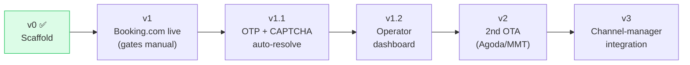

# Accounts Pilot — Build Plan

Phased delivery. Each phase ends at a demoable milestone with explicit acceptance
criteria. We do not start a phase until the previous milestone is green.

---

## Status snapshot

| Phase | State | Demo |
|---|---|---|
| **v0 — Scaffold** | ✅ **Done** | `validate` + `plan` run; 4 tests pass |
| v1 — Booking.com live | ⏳ Next | A real listing reaches `submitted` |
| v1.1 — Auto gates | ◻ | OTP + CAPTCHA pass without a human |
| v1.2 — Dashboard | ◻ | Operator clears gates from a UI |
| v2 — 2nd OTA | ◻ | One profile → two OTAs |
| v3 — CM integration | ◻ | Inventory/rates sync after listing |

---

## v0 — Scaffold ✅ (complete)

Six components wired, OTA-agnostic core, Booking.com step graph, CLI, sample data, tests.

**Acceptance (met):**
- [x] `validate examples/sample_property.json` → OK
- [x] `plan` prints the 14-step AUTO/GATE graph
- [x] `pytest` → 4 passed
- [x] All modules compile

---

## v1 — Booking.com live (gates manual)

**Goal:** a real property reaches Booking.com `submitted`, with the AUTO steps automated and
the four gates completed manually by a human in the same browser session.

### Tasks
1. **Selector-capture pass** *(the critical task)*
   - Drive live `join.booking.com` via `/browse` (or CloakBrowser) with a throwaway test property.
   - For each AUTO step, capture resilient locators (prefer role/label/text over brittle CSS).
   - Record where account / OTP / CAPTCHA actually appear, and whether the page needs stealth.
2. **Fill the `# TODO(selector)` lines** in `adapters/booking_com.py`.
3. **Real field mapping** — confirm Booking.com's enums for property type, bed types, facility codes; complete `_PROP_TYPE_MAP` / `_AMENITY_MAP`.
4. **Map-pin handling** — drop marker from lat/long, else geocode the address.
5. **Photo upload** — wire `set_input_files` to the real file input.
6. **Manual-gate UX** — when parked, print clear instructions + the screenshot path so the human knows exactly what to do, then `resume`.
7. **Harden the runtime** — retries/timeouts on flaky wizard pages; save `storage_state` so `resume` doesn't re-login.

### Acceptance
- [ ] A throwaway test property is driven through all AUTO steps automatically.
- [ ] Job parks cleanly at `awaiting_account`, `awaiting_bank`, `awaiting_contract`.
- [ ] After manual completion of each gate, `resume` advances correctly.
- [ ] Listing reaches `submitted`; audit log + screenshots prove every step.

### Risks
- Booking.com **A/B-tests** its onboarding → selectors drift. Mitigation: role/text locators + a selector-health check.
- **Bot wall earlier than expected** → may need CloakBrowser from step 1. Mitigation: the runtime already supports per-step stealth.

---

## v1.1 — Auto-resolve OTP + CAPTCHA

**Goal:** raise hands-off-ness — OTP and CAPTCHA pass without a human.

### Tasks
1. **OTP email resolver** — IMAP poll a per-property inbox (or SES/Mailgun inbound), extract the code, continue.
2. **OTP SMS resolver** — provider API (MSG91/Kaleyra/Twilio).
3. **CAPTCHA solver** — wire 2Captcha/CapSolver (createTask → poll → inject token) behind the existing `CaptchaSolver` interface.
4. **Per-property inbox/number provisioning** — how each property gets its verification channel.

### Acceptance
- [ ] OTP gate auto-resolves end-to-end on a test run.
- [ ] A served CAPTCHA is solved and injected without a human.
- [ ] Failures fall back to PARK (never silently hang).

---

## v1.2 — Operator dashboard

**Goal:** humans clear gates from a UI instead of the CLI.

### Tasks
1. **FastAPI** endpoints: list jobs, show a job + audit + screenshot, "resume" trigger.
2. **Dashboard** — start with **Retool or Streamlit** (hours, not weeks); migrate to Next.js when it's a real product surface.
3. **Notifications** — ping the operator (email/Slack) when a job parks.
4. **Move SQLite → PostgreSQL** once multi-user.

### Acceptance
- [ ] Operator sees parked jobs + the screenshot and completes gates from the UI.
- [ ] No CLI needed for day-to-day gate clearing.

---

## v2 — Second OTA (proves OTA-agnostic)

**Goal:** one Property Profile onboards to a second OTA (Agoda or MMT/Goibibo) by adding
**only** a new adapter.

### Tasks
1. Selector-capture pass for the new OTA.
2. `adapters/<ota>.py` + register in `REGISTRY`.
3. Confirm zero changes needed to core/runtime/gates/state/audit.

### Acceptance
- [ ] `onboard --ota <new>` works off the same profile.
- [ ] Core modules untouched (the proof).

---

## v3 — Channel-manager integration (the step we deliberately skipped)

**Goal:** after a listing is live, sync inventory/rates/restrictions (Channex or direct
connectivity). This is where Accounts Pilot meets the existing DigiStay channel layer.

> Out of scope until v1–v2 prove the onboarding engine. Listed here so the seam is explicit.

---

## Engineering workflow

- **Branching:** `type/<slug>` per change; PR before merge.
- **Tests:** every adapter ships graph + mapping unit tests; selector health checks in CI.
- **Secrets:** `.env` / Vault only, never committed.
- **Definition of done (per phase):** acceptance boxes ticked + audit evidence + docs updated.

---

## The single most important next action

**Run the Booking.com selector-capture pass** (v1, task 1). Everything in v1 is blocked on
knowing the live DOM. It's a `/browse`/CloakBrowser session against `join.booking.com` with a
throwaway property — and it doubles as discovery for where the bot wall and gates really sit.
