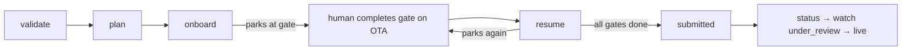

# Accounts Pilot — Operations Runbook

How to run, operate, and troubleshoot an onboarding. Practical, command-first.

---

## Setup (once)

```powershell
cd "C:\Users\manis\Desktop\Accounts Pilot"
python -m venv .venv
.venv\Scripts\activate
pip install -r requirements.txt
playwright install chromium        # only needed for live `onboard`
copy .env.example .env             # then edit .env
```

> CloakBrowser is optional: `pip install cloakbrowser`. Without it the runtime falls back to
> plain Playwright (fine until an OTA throws a bot wall).

---

## The command surface

| Command | What it does | Touches a browser? |
|---|---|---|
| `validate <profile.json>` | Parse + validate a profile | ❌ |
| `plan --profile <f> --ota booking_com` | Print the step graph (dry run) | ❌ |
| `onboard --profile <f> --ota booking_com` | Run AUTO steps, park at first gate | ✅ |
| `resume <job_id> --profile <f>` | Continue a parked job | ✅ |
| `status [job_id]` | List jobs / show one + audit trail | ❌ |

`job_id` is always `<ota>__<property_id>` — e.g. `booking_com__DS-HOTEL-001`.

---

## Typical flow



```powershell
# 1. sanity-check the data
python -m accounts_pilot.cli validate examples/sample_property.json

# 2. see the plan
python -m accounts_pilot.cli plan --profile examples/sample_property.json --ota booking_com

# 3. start onboarding (parks at the account gate)
python -m accounts_pilot.cli onboard --profile examples/sample_property.json --ota booking_com

# 4. a human creates the Booking.com login in the open browser, then:
python -m accounts_pilot.cli resume booking_com__DS-HOTEL-001 --profile examples/sample_property.json

# repeat resume after each gate (bank, contract) until 'submitted'

# 5. watch state
python -m accounts_pilot.cli status booking_com__DS-HOTEL-001
```

---

## Where things land

| Artifact | Location |
|---|---|
| Job + audit DB | `data/accounts_pilot.db` (SQLite) |
| Screenshots at parks | `data/artifacts/<job_id>_<step>.png` |
| Saved browser session | `storage_state.json` (gitignored) |
| Secrets | `.env` (gitignored) |

Inspect the DB directly:
```powershell
python -c "import sqlite3,sys; c=sqlite3.connect('data/accounts_pilot.db'); [print(r) for r in c.execute('select at,step,action,detail from audit_events order by id')]"
```

---

## Gate playbook

| Gate | State | Who | Action |
|---|---|---|---|
| `account` | `awaiting_account` | Human | Create the partner login on the OTA |
| `otp` | `awaiting_otp` | Auto (v1.1) / Human | Enter the emailed/SMS code |
| `bank` | `awaiting_bank` | **Human only** | Enter payout/bank details directly on the OTA |
| `contract` | `awaiting_contract` | **Human only** | Read + accept the partner agreement |
| `captcha` | `awaiting_captcha` | Auto (v1.1) / Human | Solve the challenge |

After completing the gate, always `resume`.

---

## Troubleshooting

| Symptom | Likely cause | Fix |
|---|---|---|
| `EmailStr` import error | `email-validator` missing | `pip install "pydantic[email]"` |
| Browser closes immediately | `HEADLESS=true` in `.env` | set `HEADLESS=false` to watch |
| `navigator.webdriver: true` / blocked | stealth off or CloakBrowser missing | `pip install cloakbrowser`; adapter step needs `needs_stealth=True` |
| Selector not found | Booking.com A/B variant / drift | re-run selector-capture; prefer role/text locators |
| Job won't resume | wrong `job_id` | check `status` for the exact id |
| Stuck at OTP forever | no resolver configured (expected in v1) | enter the code manually, then `resume` |
| Runs feel slow | humanisation is on (mouse paths + typing) — expected vs OTAs | lower `THINK_*` / `KEY_DELAY_*` in `.env`, or `HUMANIZE=false` for non-hostile test pages |
| Still flagged despite stealth | behaviour OK but IP/rate is the tell | add a residential `CLOAK_PROXY`, slow the rate; mouse alone isn't sufficient |
| Console shows `�` | Windows cp1252 vs unicode | cosmetic only; `set PYTHONUTF8=1` to fix |

---

## Safety rules (non-negotiable)

1. **Never commit `.env`, `data/`, or `storage_state.json`** — all gitignored; verify before any push.
2. **Never add bank/payout fields to the Profile** — human-only gate by design ([ADR-005](DECISIONS.md)).
3. **One person stays on every account / bank / contract gate** — these are not automatable, by rule.
4. **Throwaway test property for selector-capture** — never dry-run against a real listing you care about.
